# Security Lab SIEM & EDR Multi-OS (Linux & Windows)

**Atelier pratique de déploiement et de supervision de la sécurité des endpoints Linux et Windows à l’aide de Wazuh (SIEM & EDR) dans un environnement Cloud AWS.**

---

### 1. Introduction

Dans un contexte où les cyberattaques ciblant les endpoints sont de plus en plus fréquentes et sophistiquées, la mise en place de solutions de supervision et de détection avancée devient indispensable.

Cet atelier a pour objectif la mise en œuvre complète d’une plateforme de sécurité basée sur **Wazuh**, combinant les approches **SIEM (Security Information and Event Management)** et **EDR (Endpoint Detection and Response)**, déployée dans un environnement **Cloud AWS**.

L’atelier s’appuie sur un laboratoire **multi-systèmes (Linux et Windows)** afin de reproduire un contexte réaliste proche de celui rencontré en entreprise ou dans un **SOC (Security Operations Center)**.

---

### 2. Objectifs pédagogiques de l’atelier

Les objectifs principaux de cet atelier sont les suivants :

- Concevoir une architecture Cloud sécurisée sur AWS  
- Créer et configurer un réseau virtuel isolé (**VPC**)  
- Déployer une solution **SIEM & EDR** centralisée avec Wazuh  
- Superviser et analyser des événements de sécurité réels  
- Comprendre la corrélation des événements **multi-OS**  
- Mettre en évidence les capacités de détection et de réponse aux incidents  

---

### 3. Architecture du laboratoire

L’architecture déployée est composée des éléments suivants :

- **EC2-1 (Ubuntu 22.04)** : Serveur Wazuh  
  *(Manager, Indexer, Dashboard)*  
- **EC2-2 (Ubuntu 22.04)** : Client Linux avec agent Wazuh  
- **EC2-3 (Windows Server)** : Client Windows avec agent Wazuh et option **Sysmon**
       

#### Flux réseau principaux

- **Agents → Serveur Wazuh** : `1514/TCP`  
re- **Enrôlement des agents** : `1515/TCP`  
- **Accès au Dashboard Wazuh** : `443/TCP (HTTPS)`

---

### 4. Mise en place de l’infrastructure Cloud AWS

#### 4.1 Création d’un VPC personnalisé

Afin d’isoler totalement l’environnement du laboratoire et de maîtriser le réseau, un **VPC dédié** a été créé manuellement.

- **Nom du VPC** : `VPC-SIEM-LAB`  
- **Plage CIDR** : `10.0.0.0/16`  

Cette approche permet d’éviter l’utilisation du VPC par défaut d’AWS et offre un **meilleur contrôle du routage, de la sécurité et de l’isolation réseau**.

   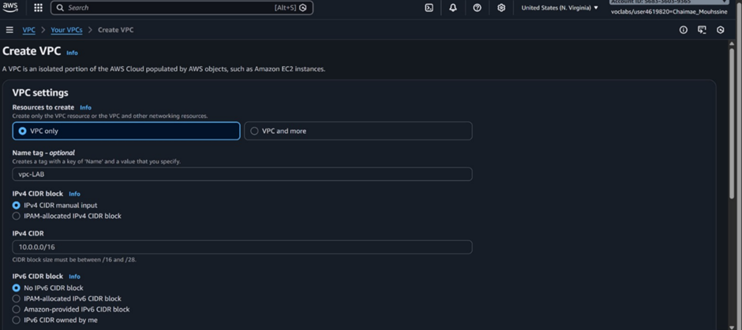
La création d’un VPC personnalisé permet d’éviter l’utilisation du VPC par défaut d’AWS et offre un meilleur contrôle sur le routage, la sécurité et l’isolation réseau. 4.2 Création du subnet public

#### 4.2 Création du subnet public
Un subnet public a été configuré pour héberger toutes les instances EC2.
- **Nom du subnet** : Subnet-Public-SIEM
- **CIDR** : 10.0.1.0/24
- **Attribution automatique d’IP publique** : activée
   
   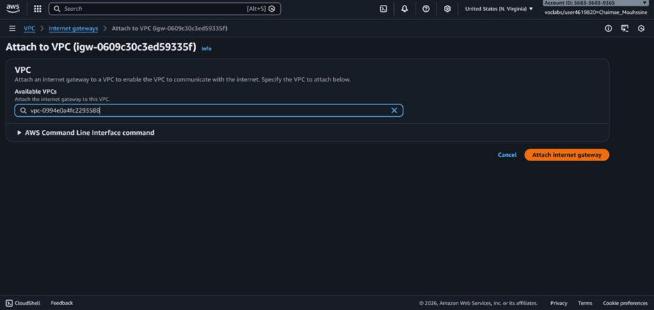
Ce choix simplifie la communication entre les instances et permet l’accès externe au dashboard Wazuh et aux services distants (SSH / RDP).
#### 4.3 Internet Gateway et table de routage
- 	Création d’une Internet Gateway (IGW)
-	Association de l’IGW au VPC
-	Création d’une table de routage publique
-   Ajout de la route
    
Cette configuration garantit l’accès Internet pour les instances tout en conservant une architecture réseau simple et efficace.

---
### 5. Déploiement des instances EC2 dans le VPC
Toutes les instances ont été déployées dans le même VPC et le même subnet, assurant une communication privée directe.
#### 5.1 Wazuh server 

#### 5.1 Client Linux
- 	Ubuntu 22.04 (t2.micro)

### 5.2 Windows Client

- Les instances sont créé avec succès 

---
### 6. Configuration des Security Groups
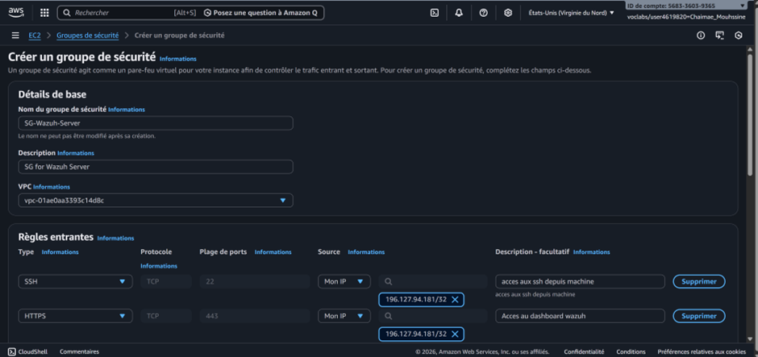

---

### 7. Installation et configuration de Wazuh All-in-One
- Enrôlement via le Dashboard Wazuh
Mise à jour du système :
sudo apt update && sudo apt -y upgrade

curl -sO https://packages.wazuh.com/4.7/wazuh-install.sh

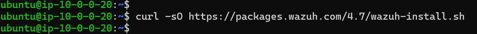

sudo bash wazuh-install.sh -a
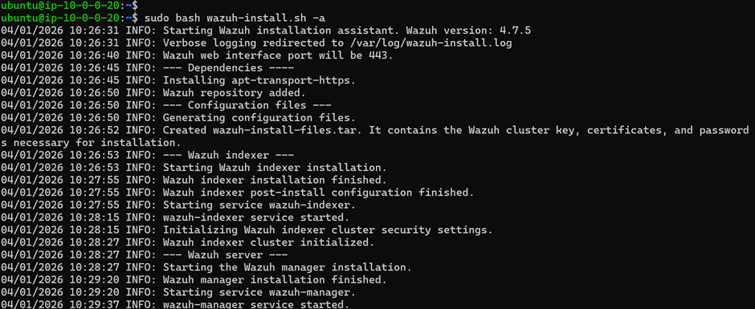
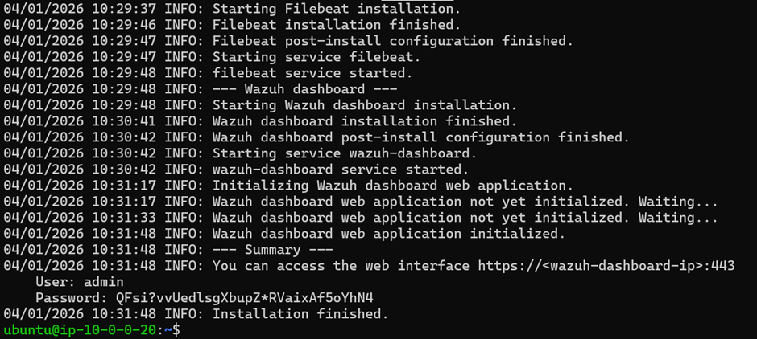

À la fin, le script fournit :
-	URL du dashboard: https:<YOURIPADRESSE>:443
-	Utilisateur : admin
-	Mot de passe : CsJpEbgRNAZR495aMkkvukVUceUvdv+9
Vérification des services :

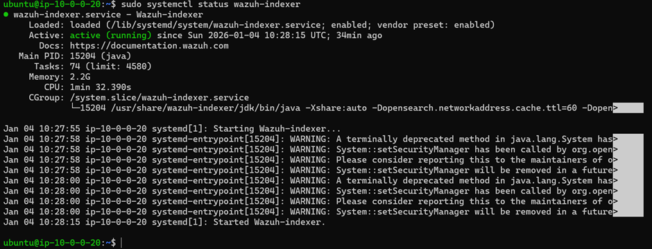
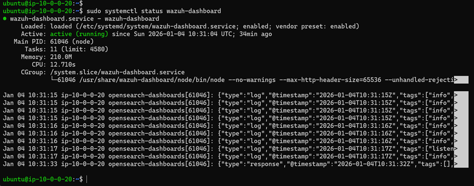
 
---

- Connexion à l’interface Wazuh
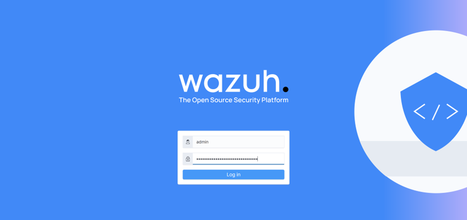
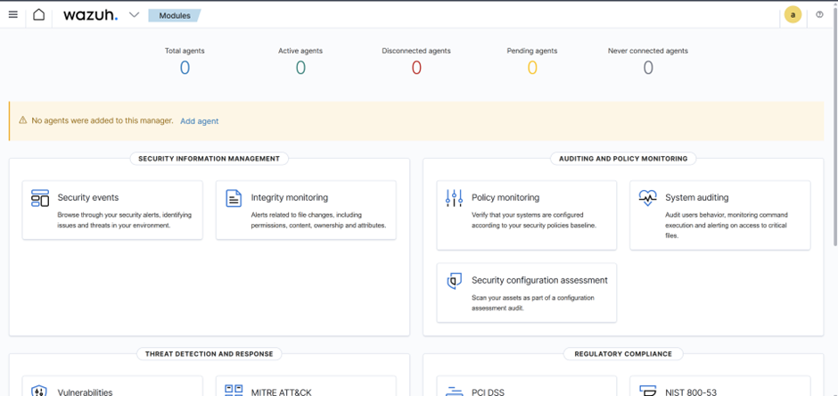

---

### 8.Enrôler le client Linux et Windows
- Via le dashboard Wazuh → Agents management → Deploy new agent

- Sélection Linux → Copier commandes et exécuter sur le client

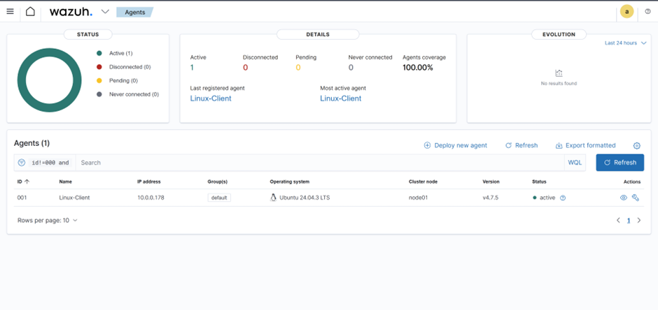

#### Connexion au EC2 WINDOWS_CLIENT via RDP
- 	On ouvre cmd+r et on tape la commande : mstsc

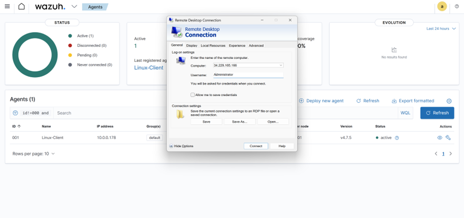

#### Passer dans powershell 
- Installation agent depuis dashboard (PowerShell)
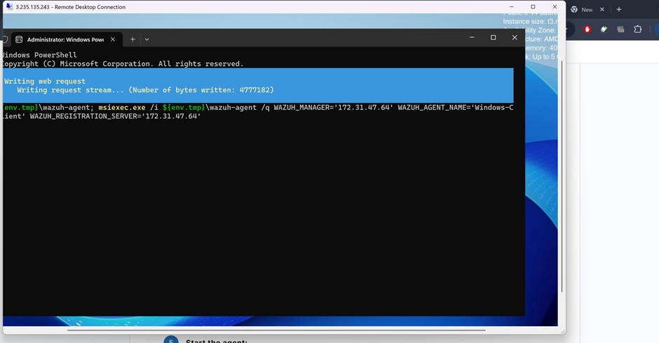

- L’enrôlement centralisé facilite la gestion des endpoints à grande échelle.
---

###  9. Scénarios de démonstration SIEM & EDR
#### 9.1 Côté Linux
#### 9.1.1 Scénario 1 — Tentatives SSH échouées (bruteforce simulé)
Sur Linux-Client (ou depuis une autre machine), fais plusieurs tentatives de login SSH invalides :
ssh fakeuse@10.0.0.178

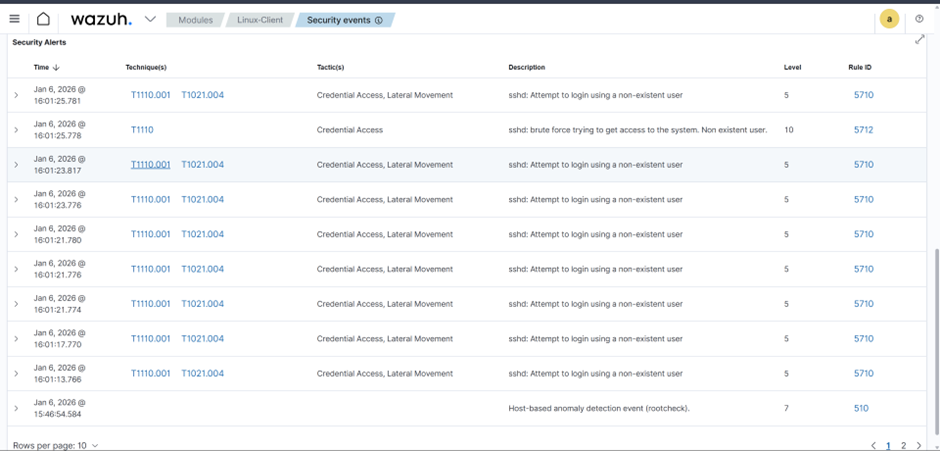
-	Tentatives SSH échouées
-	Élévation de privilèges
-	Modification de fichiers sensibles (FIM)
#### 9.1.2 Scénario 2 — Élévation de privileges
- sudo su
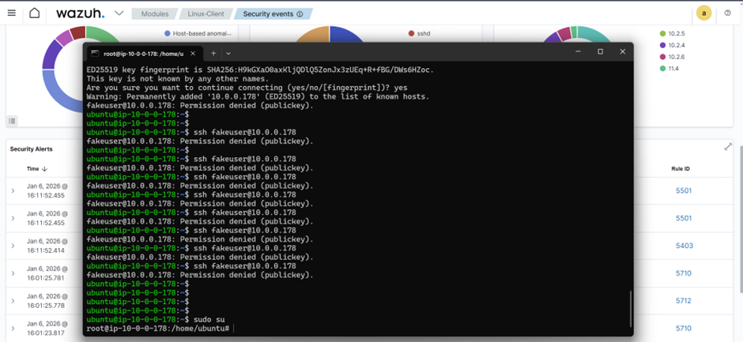
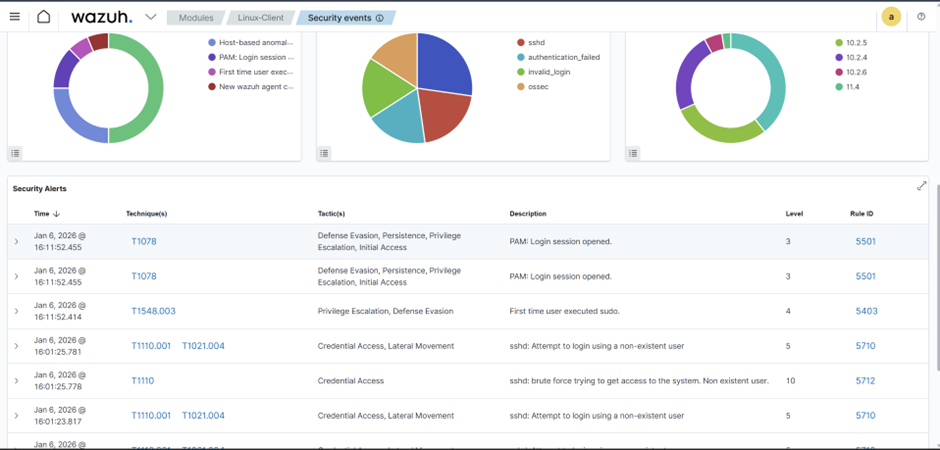

 #### 9.1.3 Scénario 3 — Modification fichier sensible 
 echo "test" | sudo tee -a /etc/passwd
 
 
#### 9.2 Scénarios côté Windows
##### 9.2.1 Scénario 1 — Échecs de login 
- Sur Windows : on realise des connexions RDP avec mauvais mot de passe 

##### 9.2.2 Scénario 2 — Création d’un utilisateur local
PowerShell (Admin) :
-	net user labuser P@ssw0rd! /add
-	net localgroup administrators labuser /add

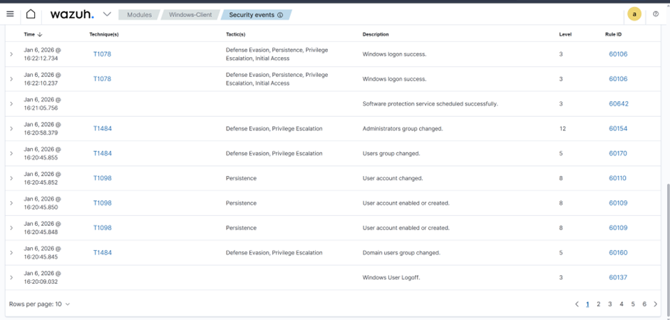
##### 9.2.3 Scénario 3— Option “EDR plus riche”: installer Sysmon
-	Invoke-WebRequest -Uri https://download.sysinternals.com/files/Sysmon.zip -OutFile C:\Sysmon.zip 
-	Expand-Archive -Path C:\Sysmon.zip -DestinationPath C:\Sysmon 

Ces scénarios démontrent la capacité de Wazuh à détecter des comportements suspects et à générer des alertes pertinentes.

---
### 10. Visualisation dans le Dashboard Wazuh

---
 ### 11. Conclusion
Cet atelier a permis de mettre en œuvre une plateforme SIEM & EDR complète, intégralement conçue et configurée en détail, depuis la création du réseau Cloud jusqu’à l’analyse avancée des événements de sécurité.
La création d’un VPC personnalisée, le déploiement multi-OS et la configuration fine des règles de sécurité illustrent une démarche professionnelle conforme aux standards des infrastructures modernes.
Wazuh s’impose comme une solution robuste, capable de fournir une vision centralisée, proactive et corrélée des événements de sécurité, renforçant ainsi significativement la posture de sécurité globale.
